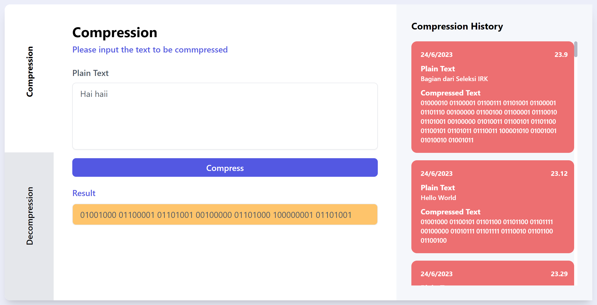

# 🧩 LZW Compressor
> Frontend side of TextFile compression using LZW Algorithm with MERN techstack

## General Information
LZW Compressor, as its name, is a simple webapp text-file-compression using popular compression algorithm, Lempel-Ziv-Welsh algorithm. This app receive the string input to be compress into binary bytes and you can decompress it also to get the original string. This app also give the compression and decompression history using mongoDB database and available online on a website. Compression algorithm could be enhanced with BWT (Burrows-Wheeler Transform) associated with modified Move-to-front (MTF) compression algorithm with calculated compression and decompression rate to state the remaining number of characters after compression and decompression process. Furthermore, the project information is also provided for future improvements.

## Project Structure
```bash
.
├─── img
├─── public
├─── src
│   ├─── components
│   │   ├─── Cards
│   │   │   ├─── CompressionCard.jsx
│   │   │   └─── DecompressionCard.jsx
│   │   └─── Forms
│   │   │   ├─── CompressionForms.jsx
│   │   │   └─── DecompressionForm.jsx
│   ├─── App.css
│   ├─── App.jsx
│   ├─── index.css 
│   └─── main.jsx
├─── .env
├─── .gitignore
├─── index.html
├─── package-lock.json
├─── package.json
├─── postcss.config.cjs
├─── README.md
├─── tailwind.config.js
└─── vite.config.js
```

## Prerequisites
- node.js (v 18.12.1)
- npm (v 8.19.2)
- React (v 18.2.0)
- Tailwind (v 3.3.2)

## Algorithms
Algorithm implemented on backend side. Further implementation of algorithm stated on [this repository](https://github.com/mikeleo03/LZW-Compressor_Backend)

### Process Flow
Basic algorithm flow for compression is
```bash
INPUT -> LZW -> OUTPUT
``` 
but the compression process also could be enhanced using BWT and modified MTF algorithm with this flow
```bash
INPUT -> LZW -> BWT -> MTF -> OUTPUT
``` 

Then basic algorithm flow for decompression is
```bash
INPUT -> LZW -> OUTPUT
``` 
but the decompression process of an enhanced string could be proceed with this flow with this flow
```bash
INPUT -> MTF -> BWT -> LZW -> OUTPUT
``` 

### Lempel-Ziv-Welsh (LZW) Algorithm
LZW is a lossless compression algorithm. This compression process is implemented as follows:
1. Create a dictionary filled with 255 ASCII characters.
2. Parse the string input by character then check whether the current string is in the dictionary
  a. If it is in the dictionary, then append it to the current string
  b. If not, then add the current string to the output and add the current string, appended with the current reading character to the dictionary.
3. Repeat the whole process until the last character in the string is going to be proceed.
4. Push the last to the output.

### Burrows-Wheeler Transform (BWT) Algorithm
BWT is a method to do a string clustering in order to increase the effectiveness of compression process. To note, this algorithm really help much the implementation of the MTF. The encoding process is implemented as follows:
1. Insert a null character to border and help the decoding process.
2. Create some rotation posiibility of the string input and store it in a matrices then sort it alphabetically.
3. Take the last matrix to be the output

### Move-to-front (MTF) Algorithm
MTF is another popular compression algorithm designed to improve the performance of entropy encoding techniques of compression. Modified implementation to this algorithm is to put the frequently-used character in front of array to minify the encoded characters. This algorithm is implemented as follows:
1. Maintain an ordered list of legal symbols (in this case, modified-order of 255 ASCII Character). 
2. Read one character at a time from input string. 
3. Add up the position at which that character appears in the list to the solution list. 
4. Move that character to front of the list and repeat the process until indexes for all input characters are obtained.

## Available Scripts
In the project directory, you can run:

### `npm start dev`

Ths runs the app in the development mode.

The page will reload if you make edits.<br />
You will also see any lint errors in the console. You can also use the environment by appyling the basic .env configuration on .env.example file.

## Screenshots


## Contributors
<a href = "https://github.com/mikeleo03/markdown-editor/graphs/contributors">
  
</a>