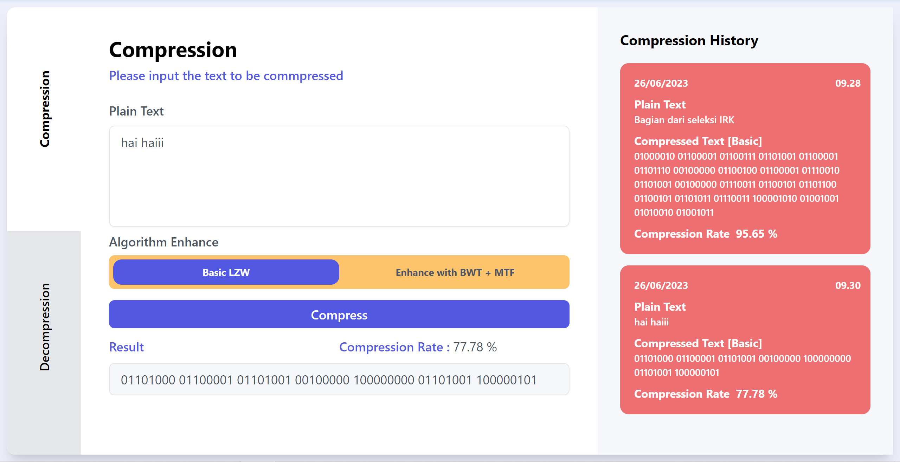

# 🧩 LZW Compressor
> Frontend side of TextFile compression using LZW Algorithm with MERN techstack

## General Information
LZW Compressor, as its name, is a simple webapp txt-file compression using popular compression algorithm, LZW algorithm. This app receive the string input to be compress into binary bytes and you can decompress it also to get the original string. This app also give the compression and decompression history using mongoDB database and available online on a website. Furthermore, the project information is also provided for future improvements.

## Prerequisites
- node.js (v 18.12.1)
- npm (v 8.19.2)
- React (v 18.2.0)
- Tailwind (v 3.3.2)

## Process Flow
### Input
Input of compressing process is a string, constructed by ASCII character and input of the decompressing process is a binary bytes of a compressed string.
### Algorithms
Algorithm applied for this process is LZW algorithm. The algorithm is able to compress and decompress the input.
### Output
Input of compressing process is a binary bytes of a compressed string and input of the decompressing process is a decompressed string.

## Available Scripts
In the project directory, you can run:

### `npm start dev`

Ths runs the app in the development mode.

The page will reload if you make edits. 
You will also see any lint errors in the console. You can also use the environment by appyling the basic .env configuration on .env.example file.

## Screenshots

## Contributors
